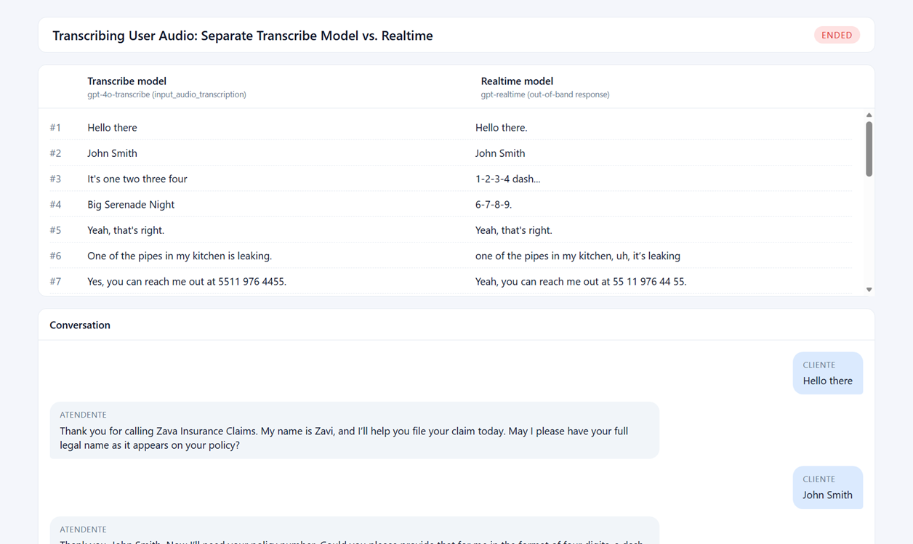
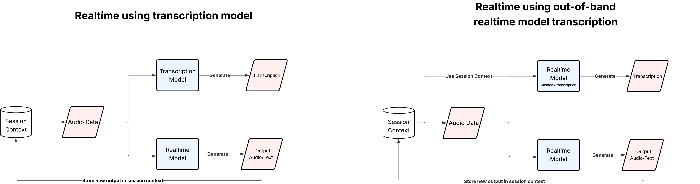
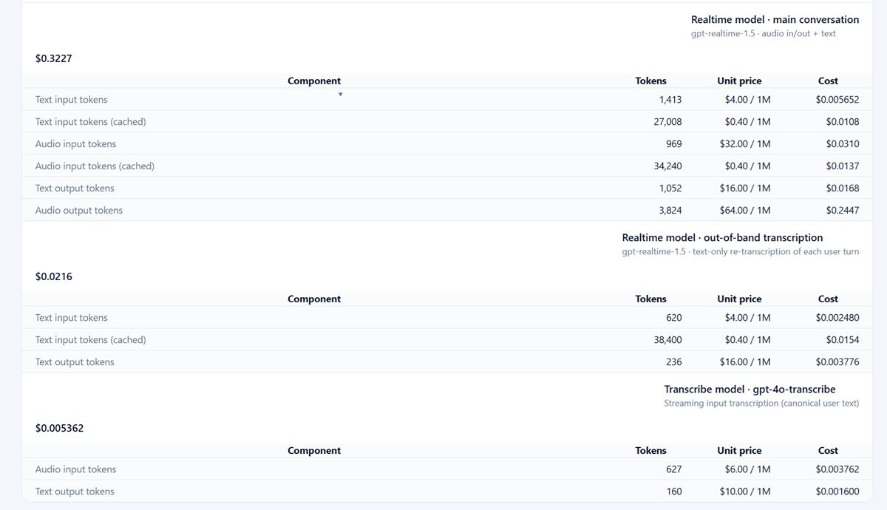

#  Transcribing User Audio using gpt-realtime and gpt-transcribe  

Browser demo for Azure OpenAI **Realtime** voice with **side-by-side transcription**:
the Realtime model's own out-of-band (OOB) user-turn transcript is shown next to a parallel
`gpt-4o-transcribe` transcript so you can compare quality, latency, and cost in real time.

The web app is a single Container App that serves a React SPA and a small Flask token service.
Authentication to Azure OpenAI uses **managed identity** (no keys).



---

## Architecture

- **Frontend** — Vite + React + TypeScript. Captures mic audio, opens a WebRTC peer connection
  to Azure OpenAI Realtime, renders the assistant transcript, the Realtime-OOB user transcript,
  and the `gpt-4o-transcribe` user transcript in three aligned columns plus a per-source cost panel.
- **Backend** — Flask. Mints ephemeral Realtime client secrets via
  `POST /openai/v1/realtime/client_secrets` and exposes them at `/api/token`. Also serves the built
  SPA from the same origin.
- **Azure OpenAI / Foundry** — `gpt-realtime`, `gpt-realtime-mini`, `gpt-4o-transcribe`
  deployments created automatically by the Bicep.
- **Hosting** — Azure Container Apps with a user-assigned managed identity that has:
  - `AcrPull` on the Azure Container Registry (image pull)
  - `Cognitive Services OpenAI User` on the Foundry account (token minting)
<br>


The diagram contrasts the two approaches this app runs side-by-side:

- **Left — Realtime + Transcription Model.** Audio is fanned out to both a dedicated transcription model (e.g. `gpt-4o-transcribe`) and the Realtime model. The transcription model produces the user-turn text; the Realtime model produces the spoken/text reply.
- **Right — Realtime OOB transcription.** The Realtime model is asked, via an out-of-band response with `metadata=transcription`, to transcribe the same audio it just answered. No separate transcription model is needed; the session context is reused.

Both transcripts are rendered in adjacent columns so you can compare quality, latency, and cost per turn.
---

## Prerequisites

- An Azure subscription with permission to create resources and role assignments.
- Tools installed locally:
  - [Azure CLI](https://learn.microsoft.com/cli/azure/install-azure-cli) (`az`)
  - [Azure Developer CLI](https://learn.microsoft.com/azure/developer/azure-developer-cli/install-azd) (`azd`) ≥ 1.23
  - Python 3.12 + `pip` (only needed to run the backend locally)
  - Node.js 20 + `npm` (only needed to run the frontend locally)
- A region with the `gpt-realtime` family available — typically **`eastus2`** or **`swedencentral`**.

---

## Deployment

The full stack (Foundry account + project + 3 model deployments, ACR, Container Apps env,
Container App, managed identity, RBAC) is provisioned by `azd up`. The image is built **remotely
in ACR** — no local Docker daemon required.

```bash
# 1) Sign in
az login --tenant <your-tenant-id>
az account set --subscription <your-subscription-id>

azd auth login --tenant-id <your-tenant-id>
# (optional) reuse az CLI auth instead of azd's:
azd config set auth.useAzCliAuth true

# 2) Create / select an azd environment
azd env new <your-rg-environment>

# 3) Required env vars
azd env set AZURE_LOCATION       eastus2
azd env set AZURE_RESOURCE_GROUP <your-rg-resource-group>

# 4) Provision + build + deploy
azd up
```

When it finishes, azd prints `SERVICE_WEB_URI` — open it in a browser.

### Redeploy after code changes

```bash
azd deploy        # rebuilds image in ACR + rolls Container App
# or
azd up            # also re-runs Bicep
```

### Tail logs

```bash
az containerapp logs show \
  --name $(azd env get-values | grep SERVICE_WEB_NAME | cut -d= -f2 | tr -d '"') \
  --resource-group $(azd env get-values | grep AZURE_RESOURCE_GROUP | cut -d= -f2 | tr -d '"') \
  --follow
```

---

## Local development

For iterating without redeploying.

### 1) Grant your user access to the Foundry account

```bash
ME=$(az ad signed-in-user show --query id -o tsv)
ACCT=$(az cognitiveservices account show -g <rg> -n <foundry-account> --query id -o tsv)
az role assignment create \
  --assignee-object-id $ME --assignee-principal-type User \
  --role "Cognitive Services OpenAI User" --scope $ACCT
```

### 2) Configure `.env` at the repo root

```dotenv
AZURE_OPENAI_ENDPOINT=https://<your-foundry-account>.openai.azure.com/
AZURE_OPENAI_REALTIME_DEPLOYMENT_NAME=gpt-realtime-1.5-1
AZURE_OPENAI_INPUT_AUDIO_TRANSCRIPTION_MODEL=gpt-4o-transcribe-diarize-1
AZURE_OPENAI_MINI_REALTIME_DEPLOYMENT_NAME=gpt-realtime-mini-1
```

### 3) Backend

```bash
python -m venv .venv && source .venv/Scripts/activate   # Windows bash
pip install -r web/backend/requirements.txt
python web/backend/server.py        # http://127.0.0.1:5050
```

### 4) Frontend

```bash
cd web/frontend
npm install
npm run dev                         # http://localhost:5173
```

Vite proxies `/api/*` → `http://127.0.0.1:5050`.

### 5) Python CLI (optional)

```bash
pip install -r requirements.txt
python main.py                      # uses AZURE_OPENAI_REALTIME_DEPLOYMENT_NAME
python main.py --use-mini           # uses AZURE_OPENAI_MINI_REALTIME_DEPLOYMENT_NAME
```

---

## Usage

1. Open the deployed URL (or `http://localhost:5173` locally) in **Chrome / Edge**. The browser will
   ask for microphone permission.
2. Click **Call**. Once the WebRTC connection is established, status switches to *Connected*.
3. Speak. Each user turn shows up in three columns:
   - **Assistant** — what the Realtime model says back (audio + text).
   - **Realtime OOB** — the Realtime model's own transcript of your turn.
   - **gpt-4o-transcribe** — the parallel transcription model's transcript of the same turn.
4. The **Cost** panel updates after every turn with token-level breakdowns per source.
5. Click **Hangup** to end the call, or **🔄 New call** to reset all transcripts and costs.




---

## Repository layout

```
.
├── azure.yaml                  # azd service definition (Container Apps + remote build)
├── Dockerfile                  # multi-stage: Vite build + Python runtime
├── infra/                      # Bicep (subscription scope)
│   ├── main.bicep              # RG, Foundry, resources, role assignments
│   ├── foundry.bicep           # AI Services account + project + model deployments
│   ├── resources.bicep         # ACR, Log Analytics, UAMI, ACA env, Container App
│   ├── aoai-role.bicep         # Cognitive Services OpenAI User on Foundry
│   └── main.parameters.json
├── src/                        # shared prompts + protocol used by CLI and backend
├── web/
│   ├── backend/server.py       # Flask token service + SPA host
│   └── frontend/               # React + Vite SPA
└── main.py                     # Python CLI realtime client
```
